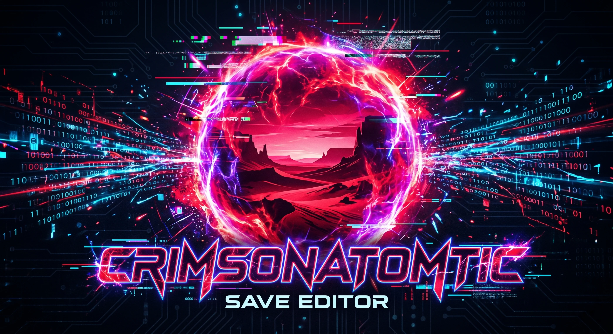
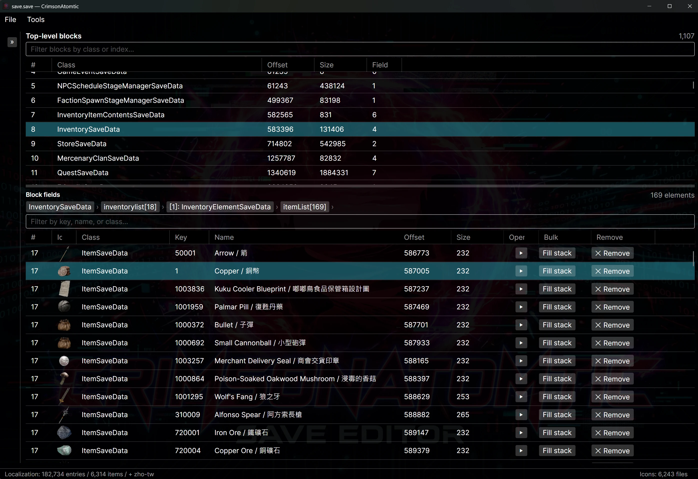

# CrimsonAtomtic

  

[](https://www.microsoft.com/windows)
[](LICENSE)
[](https://dotnet.microsoft.com/)
[](https://avaloniaui.net/)
[](https://claude.ai/code)
[](https://www.playcrimsondesert.com/)

A clean, fast save editor + game-data toolchain for **Crimson Desert** (Pearl
Abyss). It targets the live game install (currently **1.09**) for game-data /
name resolution. Save parsing itself is **version-agnostic** — each save embeds
its own schema, so the editor reads and **re-saves any patch's save (1.05–1.09)
in that save's own format**, with no version conversion (and no need to
downgrade your install to open an older save). Cross-platform goal: Windows
(primary), Linux, macOS.

  

## Layout

```
CrimsonAtomtic/
├── CLAUDE.md                 # minimal rule index — start here
├── CrimsonAtomtic.slnx       # .NET solution
├── Directory.Build.props     # shared MSBuild settings
├── Directory.Packages.props  # central package versions
├── global.json               # .NET SDK pin (10.0.x)
├── docs/                     # architecture, format specs, data hygiene policy
├── src/                      # C# / Avalonia 12 / .NET 10 / Native AOT
│   ├── CrimsonAtomtic.Core         # platform abstractions
│   ├── CrimsonAtomtic.SaveModel    # domain types (records + AOT JSON ctx)
│   ├── CrimsonAtomtic.RustInterop  # crimson-rs P/Invoke layer
│   ├── CrimsonAtomtic.Ui           # Avalonia app
│   └── CrimsonAtomtic.Tests        # xUnit 3
├── tools/                    # Python 3.12+ toolchain: extract / diff / inspect / analyze
├── vendor/                   # cloned external deps (only crimson-rs for now)
└── scripts/                  # build / setup / package scripts (PowerShell 7+)
```

## Why this project exists

A fresh save editor for Crimson Desert, built around a few clear architectural choices:

- Native AOT C# / Avalonia UI for performance and a fast startup path.
- A single Rust core (`vendor/crimson-rs`, our fork) owns all binary-format
  knowledge. No format logic is duplicated into C# or Python.
- Hygienic data flow: only sources are committed; derived files are
  regenerated, not stored. See [docs/data-policy.md](docs/data-policy.md).

For the full architectural rationale see [docs/architecture.md](docs/architecture.md).

## Editor features (current)

The UI ships with a left-rail navigator over the decoded save and a focused
set of Tools-menu bulk operations. Highlights:

- **Generic block / field editor** — every TOC block surfaced as a tree;
  per-field edit with typed validation, present/absent toggle, change
  journal, and a close-on-dirty save prompt. Composite scalars
  (`float3` / `float4` / `quaternion` / `uint4`) display + edit through a
  single bracketed textbox (e.g. `"[1.5, 2.0, -3.25]"` for a position).
- **Inventory** — virtualised lists per container, item picker with icons
  via the on-disk `IconCache/`, add-to-bag, fill-stacks-to-max (per bag and
  across all inventories), remove-element.
- **Sockets editor (v2)** — Fill / Change / Clear per slot, durability
  reset for greater gems, 3 built-in + 3 user-customisable gem sets with
  an Apply-Set toolbar, automatic `_validSocketCount` bump.
- **Dye editor** — per-item slot editor with R/G/B/A + grime + material
  (palette tier) + colour-group dropdowns, all resolved live from the
  three dye gamedata bridges. Async load + "Loading dyed items…"
  feedback for large saves.
- **Sealed Abyss Artifact challenges** — per-row "Mark Challenge Complete"
  (Pattern B v1: FAR tracker flip + X_2 sub-mission insert) plus
  **Tools → Complete All Sealed Abyss Artifact Challenges** which sweeps
  every challenge whose data shape qualifies, regardless of whether the
  artifact item is still held. Bulk dialog shows per-key skip reasons so
  out-of-scope cases (multi-objective Living_*/Cooking shapes) are
  explicitly explained. Deferred-redecode batch collapses ~423 body
  re-decodes into one (200× wall-clock speedup on the 141-challenge
  sweep).
- **Abyss Gates** — bulk **Unlock All Abyss Gates (Map Discovery)** for
  the knowledge layer plus a per-gate Lock/Unlock dialog for the gate-state
  layer.
- **Mount Unlock** — Tools → **Unlock Mounts** dialog. The six sigil-gated
  special mounts (White Bear, Silver Fang, Snowwhite Deer, Alpine Ibex,
  Rock Tusk Warthog, Phoenix) are unlocked the game-legitimate way: the
  matching *Sigil of Solidarity* is granted into Quest Artifacts; you use
  it in-game and the engine does the rest. The **Dragon (Blackstar)** is
  unlocked fully in-editor — its real mercenary element (a 212-byte captured
  blob whose schema type-indices are remapped onto your save by class name)
  is inserted, its 187-key riding knowledge injected, and its HP filled — no
  whole-save donor required.
- **Knowledge editor** — Tools → **Edit Knowledge**. Every `knowledgeinfo`
  entry bucketed into 16 curated categories, with search + learned/unlearned
  filters and a checkbox table (Select all / Unselect all / Invert). Learn
  per-item or per-category — never a blunt "learn everything" — with a
  warning before map-reveal (`Node`) or codex (`Collection`) bulk sets.
- **Vendor Buyback** — list every item the player has sold to vendors
  (StoreKey resolved live via `storeinfo.pabgb`), per-row Remove to
  free a buyback slot, per-row **Jump…** to open the item in the main
  block editor for stack / endurance / sockets / dye edits; two-pass
  filter (store-name match expands to every sold item in that store;
  item-name narrows per-row).
- **Mercenary rename** — with character portrait column driven by the
  PAZ NPC portrait pipeline, plus generic class glyphs (🐎 / 🛒 / 🎈 /
  🦌 / 👤) for mounts / wagons / animals / NPCs that don't ship a
  per-character portrait.
- **Browse Items / Browse Characters / NPCs** — reference dialogs over the
  full `iteminfo` and `characterinfo` tables. The character browser
  doubles as a **modal CharacterKey picker** invoked from the main
  edit panel for `CharacterKey`-typed scalar fields.
- **Browse Character References** — flat-list every save-side
  `CharacterKey` reference (top-level + nested) via the
  `crimson_save_list_character_refs` C ABI; per-row **Jump…** navigates
  the main block tree to the containing block. Banner warns that
  reference linkage is best-effort across different field contexts.
- **Find Items** — cross-bag search with per-row Go button that jumps the
  main window straight to the item-detail view.
- **Auto-find saves on launch** — Steam / Epic / Game Pass plain-folder
  probe + most-recent preference + per-platform backup tree.
- **First-launch disclaimer** — bilingual (中文 + English) modal shown
  once per machine; acceptance persisted to `settings.json`. Version-
  gated so future material changes can re-prompt every user.
- **32 key-resolver bridges** — name resolution for `MissionKey`,
  `QuestKey`, `StageKey`, `KnowledgeKey`, `CharacterKey`, `SkillKey`,
  `StoreKey`, `MercenaryKey`, `RegionKey`, `ItemGroupKey`, etc. — all
  decoded live from the game's own gamedata catalogs so the user sees
  "Hernandian Honor Guard Armor / 赫南迪安榮譽近衛盔甲" instead of
  `9102 <u32>`.

See [docs/status.md](docs/status.md) for the full feature ledger and roadmap.

## Stack

| Layer | Tech |
|---|---|
| App / UI | Avalonia UI 12 on .NET 10, Native AOT trimmed |
| Native core | Rust ([`vendor/crimson-rs`](vendor/crimson-rs/), C ABI + PyO3 from one cdylib) |
| Tooling | Python 3.12+ under [`tools/`](tools/) |
| Tests | xUnit 3 (C#), pytest (Python), `cargo test` (Rust) |

## Thanks

Thanks to the community save editor `CRIMSON-DESERT-SAVE-EDITOR` for being a useful reference point during early reverse-engineering.

Thanks also to NattKh's
[CRIMSON-DESERT-SAVE-EDITOR-AND-GAME-MODS](https://github.com/NattKh/CRIMSON-DESERT-SAVE-EDITOR-AND-GAME-MODS)
— a valuable reference for several save structures (including the dragon-mount
element + knowledge set behind our Mount Unlock feature).

## First-time setup

```powershell
# 1. Fetch vendored deps (clones crimson-rs from D:\Github\crimson-rs)
.\vendor\update_vendors.ps1

# 2. Build Rust core (produces crimson_rs.dll with both C ABI + PyO3)
.\scripts\build_rust.ps1

# 3. Set up Python venv + install crimson_rs via maturin develop
.\scripts\setup_python_env.ps1

# 4. Build the Avalonia UI
.\scripts\build_ui.ps1
```

## Running a tool

```powershell
# After setup, with the venv active:
python tools\extract\extract_iteminfo.py --help
```

Every script in `tools/` prints full usage when run with no arguments. See
[tools/CLAUDE.md](tools/CLAUDE.md) for conventions.

## License

[MIT](LICENSE). This project does not derive from any other editor's code;
the Rust core under `vendor/crimson-rs` is our own work.
